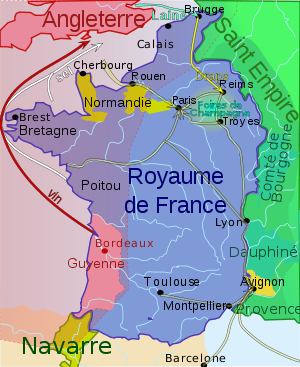

*Réponse publiée [sur Quora](https://fr.quora.com/Si-1-million-de-brillants-ingénieurs-étaient-transportés-au-Moyen-Âge-combien-de-temps-mettraient-ils-pour-fabriquer-un-ordinateur/answer/Dr-Goulu)*

18 millions de gens suffisamment éparpillés pour que la nourriture locale puisse leur être acheminée. [Démographie de Paris avait 200'000 habitants en 1328](w:Démographie_de_Paris), le royaume de France avait moins de la moitié du territoire actuel

(France en 1328 source [Philippe VI de Valois — Wikipédia](w:Philippe_VI_de_Valois))

Un million d'habitants de plus là dedans, c'est la famine garantie.
