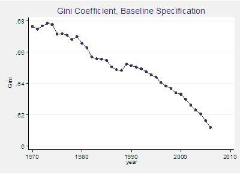

*Réponse publiée [sur Quora](https://fr.quora.com/Comment-sortir-de-ce-capitalisme-dévastateur-pour-la-planète-et-ses-citoyens-qui-ne-fait-quaugmenter-les-inégalités/answer/Dr-Goulu)*

Ma compréhension de la question est qu'elle concernait les inégalités mondiales, pas celles de la plupart des pays, ça n'a que peu de rapport tant que les différences de revenu entre pays sont nettement plus importantes qu'à l'intérieur des pays.

Les "deux types de pays" étaient la situation en 1970, aussi bien Rosling dans la video que le graphique montrant la relation PIB/habitant vs inégalités montrent qu'il n'y a plus "deux types de pays" mais un continuum parce que les pays émergents se sont rapprochés des pays développés, ce qui a diminué l'inégalité globale de manière spectaculaire :

source : [Parametric estimations of the world distribution of income](https://voxeu.org/article/parametric-estimations-world-distribution-income)

Et ça, c'est bien un résultat de la mondialisation qui a permis à ces pays de nous vendre leurs produits et de s'enrichir.

Le problème de l'augmentation des inégalités internes dans certains pays est leur problème politico économique interne. Il peut éventuellement être partiellement attribué à la hausse du chômage suite à une baisse de compétitivité face aux pays émergeants…

La France connait effectivement une petit hausse de 0.02 points de l'Indice de Gini depuis 20 ans, avec des oscillations (voir [Niveau de vie et indicateurs d’inégalités](https://www.insee.fr/fr/statistiques/2491918) INSEE ) mais toujours à un niveau très bas. Un indice de Gini de 0.30 (0.327 avant impôts) c'est très bien, pratiquement dans le top 10 de l'égalité, voir [Liste des pays par égalité de revenus — Wikipédia](w:Liste_des_pays_par_égalité_de_revenus) .

Seuls les pays du Nord de l'Europe (Finlande, Suède mais aussi Belgique) font mieux, quelques anciens pays de l'Est (Tchéquie) et ceux dont les riches ont foutu le camp suite à une guerre (Irak, Afghanistan)

Peut-être une piste à explorer ? Chasser les riches en Suisse, pas faire la guerre en France voyons ;-)
