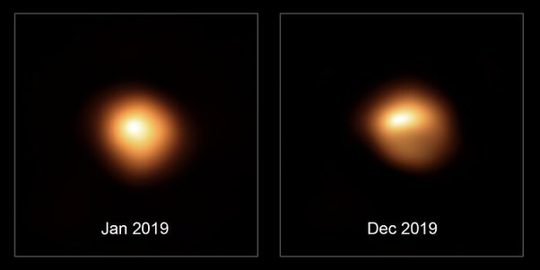

*Réponse publiée [sur Quora](https://fr.quora.com/A-t-on-déjà-observé-un-effondrement-gravitationnel-Est-ce-un-processus-long/answer/Dr-Goulu)*

Il n'y a quel les très grosses étoiles toutes proches que l'on voit mieux que comme un point, par exemple Betelgeuse , qui devrait péter un de ces prochains millénaires :

Il y a comme ça une vingtaine de [candidats de supernova](w:Liste_de_candidats_de_supernova)qu'on observe régulièrement, mais on a pas 20 Hubble pour les regarder en permanence… Si une de celle là pétait, ce qui serait déjà un fabuleux spectacle, on le verrait peut-être en direct.

L'idéal serait d'arriver à identifier les étoiles en train de faire la [Fusion du silicium](w:), parce que là on sait qu'elles n'ont plus que quelques semaines à vivre. Je ne sais pas si on sait faire ça.
