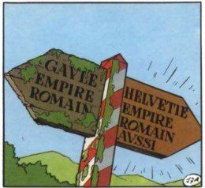

*Réponse publiée [sur Quora](https://fr.quora.com/Pourquoi-les-humains-font-ils-des-orgies/answer/Dr-Goulu)*

De l'Helvétie, Monsieur, de l'Helvétie, et du bon temps où nous étions membres du même empire :-)

