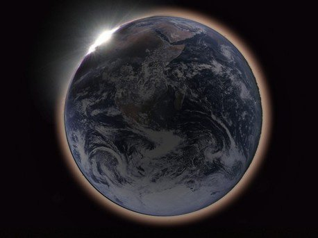

*Réponse publiée [sur Quora](https://fr.quora.com/A-quoi-ressemble-la-Terre-depuis-la-Lune-lors-d-une-éclipse-lunaire-totale-Lune-de-sang/answer/Dr-Goulu)*

Hummm c'est bien possible … dans ce cas ça ressemblerait à ça

mais c'est une simulation, je ne crois pas qu'il existe d'image réelle …

(source [https://www.redshift-live.com/en...](https://www.redshift-live.com/en/magazine/articles/Astronomy/21013-Eclipses-1.html) )
