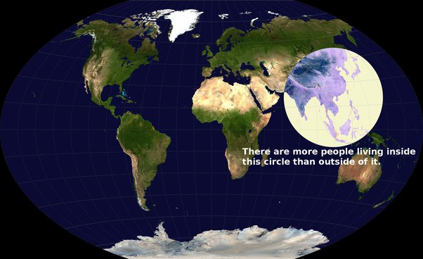

*Réponse publiée [sur Quora](https://fr.quora.com/Comment-sortir-de-ce-capitalisme-dévastateur-pour-la-planète-et-ses-citoyens-qui-ne-fait-quaugmenter-les-inégalités/answer/Dr-Goulu)*

la question était de savoir si le capitalisme est dévastateur pour la planète ET ses citoyens.

La destruction de l'environnement n'est pas un problème mineur pour moi personnellement, mais la majorité de la population qui se trouve ici

a choisi de privilégier son développement, et ma réponse n'est que le constat factuel de ceci, références à l'appui.

Comme dit, "si vous avez sous la main un système miracle qui permettrait à 8 milliards d'humains de vivre 72 ans avec plus d'égalité qu'aujourd'hui, mais sans goulag ou lobotomie obligatoire, je suis preneur."

Mais je suspecte qu'un tel système qui serait de plus respectueux de l'environnement ne peut plus exister pour une raison détaillée ci-dessous, mais qui se résume par "on est trop":

[Développement Durable et Equation de Kaya - Pourquoi Comment Combien](https://www.drgoulu.com/2009/06/06/developpement-durable-et-equation-de-kaya/#.YKaguqiiGCo)

Et si vous venez me dire que non, il faut limiter notre niveau de vie, alors je vous rappelle que le PIB/habitant moyen de la planète est à $16900, donc si vous voulez rendre la planète équitable au niveau actuel, il va falloir réduire votre PIB/hab Francais ($41343) d'un facteur 2.5, cher ami…
