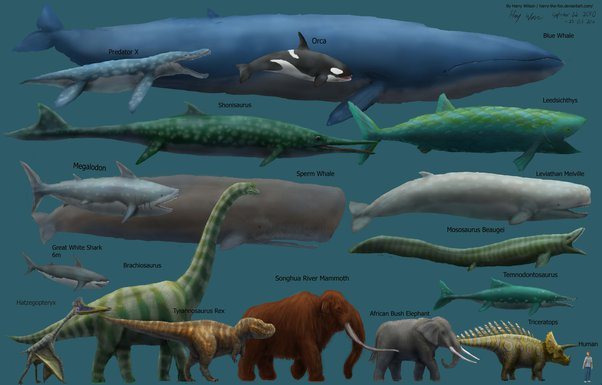

*Réponse publiée [sur Quora](https://fr.quora.com/Comment-la-science-explique-t-elle-l%C3%A9norme-diff%C3%A9rence-de-taille-entre-les-dinosaures-et-les-humains/answer/Dr-Goulu)*

D'abord, il n'y a eu que quelques espèces de dinosaures plus grands que les éléphants actuels, et ce n'était pas les mêmes pendant les ~175 millions d'années où les dinosaures ont vécu.

[https://www.businessinsider.com/...](https://www.businessinsider.com/dinosaur-size-comparison-chart-2015-6?IR=T)

Et aucun n'était aussi grand que notre cousine* la baleine bleue

Donc la science explique ça par l'évolution : si une espèce est favorisée par une grande taille elle grandit, et si elle est favorisée par une petite taille elle rapetisse, et c'est valable aujourd'hui comme au Jurassique.

Note * : notre ancêtres commun avec la baleine bleue est un [Boreoeutheria](w:) qui vivait il y a 80 à 100 millions d'années, donc pendant qu'il y avait encore des dinosaures.
