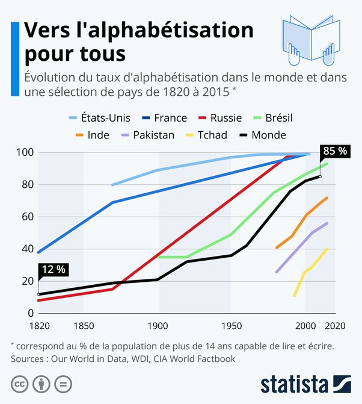
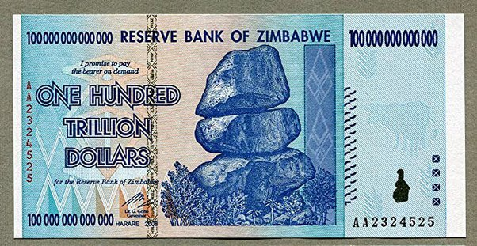

*Réponse publiée [sur Quora](https://fr.quora.com/Comment-sortir-de-ce-capitalisme-dévastateur-pour-la-planète-et-ses-citoyens-qui-ne-fait-quaugmenter-les-inégalités/answer/Dr-Goulu)*

C'est exactement l'effet qu'a eu la mondialisation, en augmentant considérablement le niveau de vie d'1 milliard de chinois, 1 milliard d'indiens, et 1 milliard de sud américains + africains ces 30 dernières années, comme le montre Rosling (entre autres).

Rosling et moi vous rejoignons à 100% sur l'investissement dans la santé et l'éducation. C'est exactement ce qui a été fait.

L'espérance de vie aujourd'hui en Afrique est celle que nous avions en Europe en 1950 :

(le léger creux de la courbe dans les années 2000 est celui du SIDA, quand [Manto Tshabalala-Msimang](w:) et d'autres ont voulu le soigner avec des médecines traditionnelles…)

Quand à l'éducation, voilà où on en est :

Il ne faut pas se méprendre : il reste beaucoup à faire, mais le monde a ENORMEMENT changé en 50 ans, et change de plus en plus vite

[La fortune totale des milliardaires est de 10'200 milliards](https://www.lefigaro.fr/conjoncture/la-fortune-des-milliardaires-touche-de-nouveaux-sommets-durant-la-pandemie-20201007). Répartis entre les 4 milliards d'habitants les plus pauvres, ils recevraient 2550 dollars chacun. Une seule fois. En actions de sociétés, parce que c'est sous cette forme que les milliardaires ont leur fortune, pas en cash.

Ne le prenez pas mal, mais l'économie de Bisounours ne marche pas. Le Zimbabwe a essayé et réussi a rendre toute sa population milliardaire. Avec ce billet :

on pouvait acheter un Coca…

Mon grand oncle qui vient de décéder en Roumanie aurait pu vous raconter comment il produisait plus sur ses 1000m2 de jardin privé que sur un hectare du kolkhoze modèle du Génie des Carpates sur lequel il faisait semblant de travailler…
