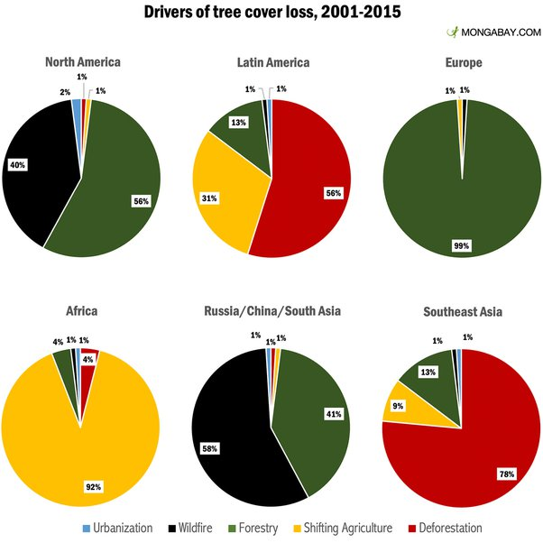
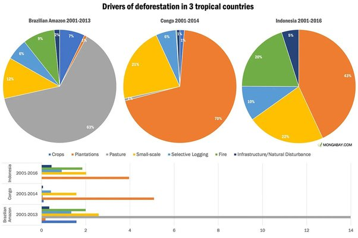

*Réponse publiée [sur Quora](https://fr.quora.com/L-homme-est-il-%C3%A0-l-origine-de-la-d%C3%A9forestation/answer/Dr-Goulu)*

L'homme non. Des milliards d'hommes oui.

[https://fr.wikipedia.org/wiki/D%...](w:Déforestation)

> La moitié des forêts de la planète a ainsi été détruite au cours du XXe siècle.

Les causes sont très différentes selon les regions

Ou même selon les pays :

Les forêts détruites par des causes naturelles (feu en vert sur les graphiques ci-dessus) repoussent tôt ou tard. Mais là fréquence des feux augmente avec le réchauffement climatique, produit à 30% par la déforestation…
