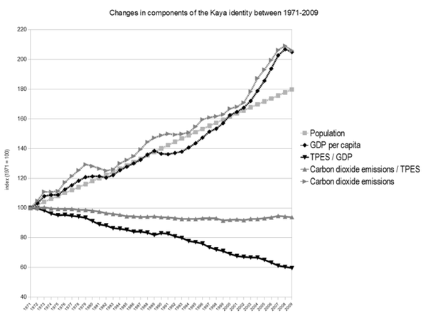

*Réponse publiée [sur Quora](https://fr.quora.com/Comment-lHomme-a-t-il-pu-arriver-au-stade-de-détruire-la-nature-à-grande-échelle/answer/Dr-Goulu)*

Voyez l'[Équation de Kaya](w:) et l'évolution de ses 4 facteurs :

Ce n'est que ces 10–20 dernières années que le GDP/capita a fait un bond au dessus de la croissance de la population, mais la croissance de base, c'est celle de la population.

Allez dire au milliard de chinois et au milliard d'indiens qui sont sortis de la misère depuis 2000 qu'ils "surconsomment" …

Parallèlement, l'[Intensité énergétique](w:Intensité_énergétique_(économie)) (TPES/GDP) de l'économie ne cesse de s'améliorer, beaucoup plus vite que l'empreinte carbone …

[400 parties par million, et moi, et moi, émoi ? - Pourquoi Comment Combien](https://www.drgoulu.com/2013/05/11/400-parties-par-million-et-moi-et-moi-emoi/)
