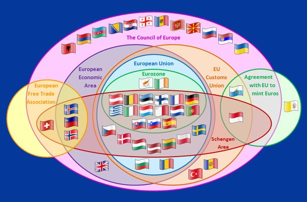

*Réponse publiée [sur Quora](https://fr.quora.com/Est-ce-que-la-Suisse-a-eu-raison-de-rompre-des-négociations-de-7-ans-avec-lUnion-Européenne-prétextant-que-la-Grande-Bretagne-avait-montré-quon-pouvait-survivre-sans-être-soumis-à-une/answer/Dr-Goulu)*

Je repense à ce diagramme :

En fait aujourd'hui on pourrait revoter sur l'adhésion avec l'EEE pour rejoindre les autres pays de l'AELE (Islande, Norvège et Lichtenstein) . En 1992 on avait refusé ça parce que c'était perçu comme un premier pas vers l'adhésion à l'UE, mais maintenant que la demande d'[Adhésion de la Suisse à l'Union européenne](w:) a été retirée (en 2016), on pourrait revoter avec de bonnes chances de succès.

Et là si l'Europe nous jette de Schengen, on sera vraiment dans la même situation que la Grande-Bretagne.
