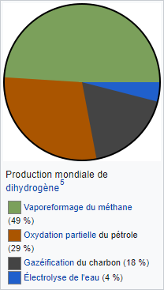

*Réponse publiée [sur Quora](https://fr.quora.com/En-quoi-lemploi-de-lhydrog%C3%A8ne-peut-r%C3%A9duire-les-co%C3%BBts-des-transports/answer/Dr-Goulu)*

Il ne peut pas.

les carburants "écologiques" sont bon marché parce qu'ils sont subventionnés et/ou les carburants fossiles taxés, mais fondamentalement, il faut produire ces combustibles à partir de sources d'énergie propres, alors que pour les fossiles il suffit de puiser dans un stock.

Pour l'hydrogène , il faut bien réaliser que l'électrolyse ne représente que 4% de la [Production d'hydrogène](w:). Les 3 autres procédés l'extraient de combustibles fossiles, en dégageant du CO2 à l'usine (où on pourrait éventuellement le séquestrer, ce qui le rendrait plus cher…)

Aujourd'hui les véhicules à hydrogène sont le meilleur exemple de [Greenwashing](w:)que je connaisse. Mais j'avoue qu'habitant à 100m de la seule station d'hydrogène de Suisse Romande (qui était en panne la dernière fois que j'y suis passé…) et à 50m d'un concessionnaire de marque japonaise qui expose une voiture à hydrogène assez jolie je dois dire, j'ai hésité à devenir un greenwasher…
