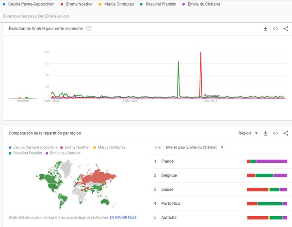
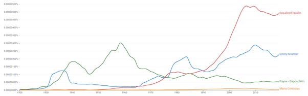
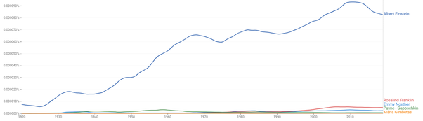

*Réponse publiée [sur Quora](https://fr.quora.com/Quelles-femmes-scientifiques-nont-re%C3%A7u-aucune-reconnaissance-pour-leurs-grandes-inventions-ou-d%C3%A9couvertes-et-ont-%C3%A9t%C3%A9-oubli%C3%A9es-par-lhistoire/answer/Dr-Goulu)*

je mentionnerais

[https://fr.wikipedia.org/wiki/Em...](w:Emmy_Noether)

Après avoir reçu le [Théorème de Noether](w:Théorème_de_Noether_(physique)), Einstein écrivit à Hilbert : « J'ai reçu hier de Mademoiselle Noether un article fort intéressant sur les invariants. J'ai été impressionné par le degré de généralité apporté par cette analyse. La vieille garde à Göttingen devrait prendre des leçons de Mademoiselle Noether ; elle semble maîtriser le sujet ! »

Je viens de faire un petit [Google Trends](https://trends.google.fr/trends/explore?q=Cecilia Payne-Gaposchkin,/m/0138rf,/m/0jfw8,/m/0mgnt,/m/03y7yh&date=all#TIMESERIES) sur les noms mentionnés dans les diverses réponses, espérant que les mouvements féministes auraient contribué à remettre ces grandes scientifiques dans la lumière, mais hélas on voit que ce ne sont que les anniversaires de leurs découvertes qui motivent un peu de curiosité

C'est un peu mieux pour certaines avec [Google Books Ngram Viewer](https://books.google.com/ngrams/graph?content=Emmy+Noether,Rosalind+Franklin,Payne-Gaposchkin,Maria+Gimbutas&year_start=1920&year_end=2019&corpus=26&smoothing=3&direct_url=t1;,Emmy Noether;,c0;.t1;,Rosalind Franklin;,c0;.t1;,Payne - Gaposchkin;,c0;.t1;,Maria Gimbutas;,c0) : leur notoriété est tout de même mieux reconnue dans la littérature.

L'axe vertical donne la proportion de livres publiés (en anglais) où elles sont citées. (je n'ai pas mentionné Emilie du Châtelet, trop francophone…)

Si on ajoute Albert Einstein pour comparer, on obtient ça :

No comment …
