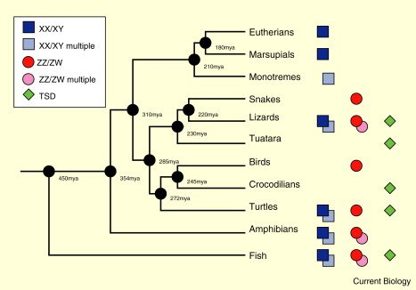

*Réponse publiée [sur Quora](https://fr.quora.com/Quelle-est-la-raison-%C3%A9volutive-pour-laquelle-les-oiseaux-suivent-le-syst%C3%A8me-ZW-de-d%C3%A9termination-du-sexe-au-lieu-du-syst%C3%A8me-XY-comme-les-humains/answer/Dr-Goulu)*

J'ai trouvé cette illustration

dans cet article

[https://www.sciencedirect.com/sc...](https://www.sciencedirect.com/science/article/pii/S0960982206019968)

Vous voyez que les oiseaux et les [Eutheria](w:)(nous…) ont divergé il y a 310 millions d années d ancêtres qui ont divergé des Amphibiens il y a 345 millions d'années.

Or les Amphibiens ont aujourd'hui encore des espèces utilisant le xy et d'autres le zw.

En gros, les oiseaux descendent d'une espèce d Amphibiens qui utilisait zw, et les euthériens d une autre qui utilisait xy.
