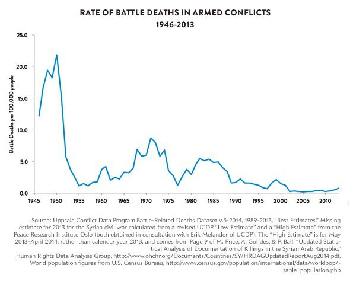
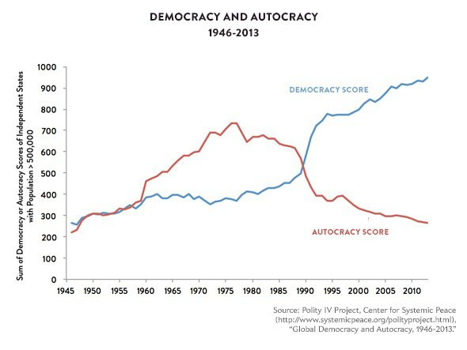

*Réponse publiée [sur Quora](https://fr.quora.com/Les-peuples-du-monde-veulent-vivre-dans-la-paix-et-la-s%C3%A9curit%C3%A9-mat%C3%A9rielle-et-sociale-et-ils-veulent-que-tous-les-peuples-en-b%C3%A9n%C3%A9ficient-%C3%A9galement-Pourquoi-les-leaders-mondiaux/answer/Dr-Goulu)*

Au contraire, les "leaders mondiaux" ont institué une [Mondialisation économique](w:)qui a beaucoup diminué la concurrence en permettant à des produits cultivés ou fabriqués à l'autre bout du monde d'être vendus dans "nos" pays où on peut les payer plus cher, en concurrençant la production locale.

Ca a permis à des milliards d'habitants des ex "pays du Tiers-Monde" de se développer rapidement et d'atteindre une sécurité matérielle proche de la notre. En 30 ans, le "Tiers-Monde" a disparu ! Regardez ça, c'est extraordinaire :

[https://www.ted.com/talks/hans_r...](https://www.ted.com/talks/hans_rosling_the_best_stats_you_ve_ever_seen?language=fr)

Pour la paix aussi, il n'y a probablement jamais eu de période aussi pacifique que ces 20 dernières années en nombre de morts par 100'000 habitants :

Même pour la sécurité sociale, la démocratie est en progrès rapide, ce qui signifie que "les leaders mondiaux", c'est vous maintenant…

Alors allez voter et assumez vos responsabilités plutôt que de la rejeter sur vos autorités.
