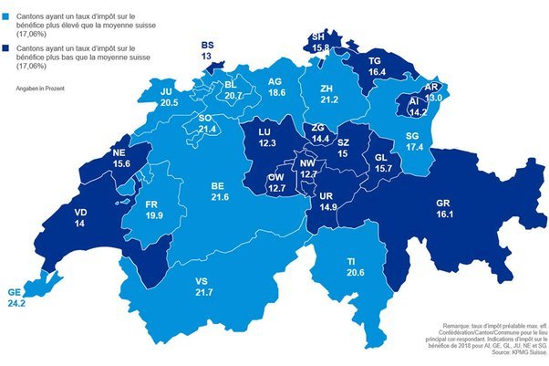
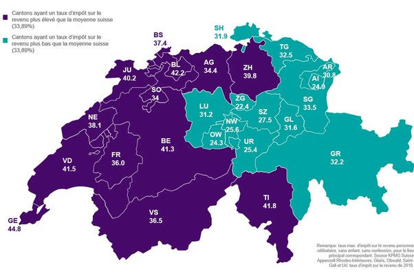

*Réponse publiée [sur Quora](https://fr.quora.com/La-Suisse-et-le-Luxembourg-ont-ils-toujours-été-des-paradis-fiscaux/answer/Dr-Goulu)*

C'est juste, en Suisse les impôts cantonaux et communaux sont beaucoup plus bas que l'impôt fédéral, et il y a de grosses différences dans le taux d'imposition du revenu, de la fortune et des entreprises.

Mais ce n'est pas si simple de distinguer la Suisse Romande de la Suisse Allemande. Voici par exemple la carte du taux d'imposition des bénéfices de entreprises:

(où on voit que les 15% récemment imposés par le G8 ne vont pas beaucoup changer les choses…)

Ca semble plus clair si on regarde le revenu, mais l'impôt à Zürich (39.8%) n'est pas si différent de Vaud par exemple (41.5%)

les cantons à faible imposition des revenus (Zug et Schwytz notamment) sont tout proches de Zürich où beaucoup de ces gens riches travaillent et où sont l'aéroport et les théâtres …

C'est pour ça que la Suisse a introduit une "péréquation intercantonale" pour que les cantons "riches" financent en partie les charges des cantons "pauvres"

source : [Communiqué de presse: «Swiss Tax Report 2019»](https://home.kpmg/ch/fr/home/media/press-releases/2019/04/premiers-bouleversements.html)
