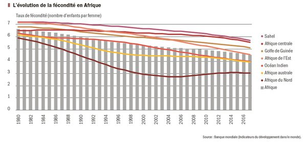

*Réponse publiée [sur Quora](https://fr.quora.com/Que-se-passerait-il-si-la-population-de-la-Terre-atteignait-20-milliards-dhabitants/answer/Dr-Goulu)*

Ce n'est pas exact. Le taux de fécondité en Afrique baisse comme il a baissé ailleurs, plus lentement dans certains pays que dans d'autres il est vrai.

Source : Banque Mondiale, tiré de[Atlas de l’Afrique AFD » : la fécondité en baisse continue depuis 40 ans](https://www.afd.fr/fr/actualites/atlas-afrique-afd-fecondite-baisse-depuis-40-ans)

Comme le montre très bien Rosling dans ses conférences, c'est quand les méchants blancs ont foutu le camp que les anciennes colonies ont commencé à se développer.

Voyez

[https://www.ted.com/talks/hans_r...](https://www.ted.com/talks/hans_rosling_global_population_growth_box_by_box)

à partir de 7:00 si vous êtes pressé.
