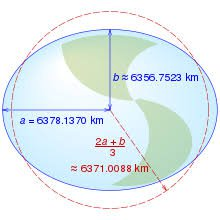
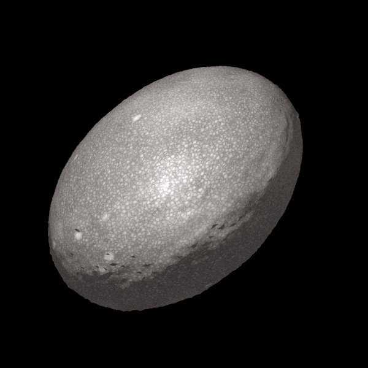

*Réponse publiée [sur Quora](https://fr.quora.com/A-quelle-vitesse-la-Terre-devrait-elle-tourner-sur-elle-m%C3%AAme-pour-sapplatir-sous-sa-force-centrifuge/answer/Dr-Goulu)*

C'est déjà le cas là Terre est aplatie par sa rotation d'environ 21 km

Ce qui fait par exemple que le sommet de l'Everest n est pas le point le plus éloigné du centre de la Terre. C'est le sommet du Chimborazo, 6268 m au dessus de l'ellipsoïde, mais près de 2000m plus loin du centre[[1]](#LWKph).

Si vous accélérez la rotation de la planète, elle va s'aplatir plus, mais comme elle ne tient que par gravité, quand les cailloux se mettront à voler à l équateur, elle ne pourra pas s'aplatir plus.

D'après [[2]](#CVYLA) ça arriverait à la Terre quand le rayon à l'équateur serait environ le triple de celui aux pôles.

[Hauméa](w:(136108)_Hauméa) est l'objet en equibre hydrostatique (= tenu en un morceau par sa propre gravité) qui tourne le plus vite de notre système solaire.elle a un rapport des rayon de 2:1 environ et une forme plutôt allongée qu'en disque.

Notes de bas de page

[[1]](#cite-LWKph)[Equateur – Un volcan, point le plus éloigné du centre de la Terre](https://www.24heures.ch/savoirs/sciences/volcan-point-eloigne-centre-terre/story/11400490)

[[2]](#cite-CVYLA)[How Flat Can A Planet Be?](https://www.forbes.com/sites/startswithabang/2017/02/14/how-flat-can-a-planet-be/)
