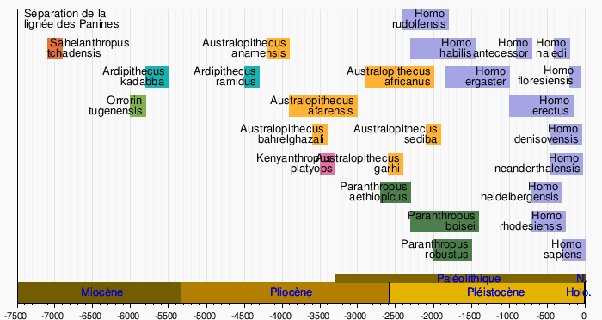

*Réponse publiée [sur Quora](https://fr.quora.com/Lhumanit%C3%A9-nen-est-elle-qu%C3%A0-ses-balbutiements/answer/Dr-Goulu)*

Ca dépend ce que vous appelez humanité

L'espèce Homo Sapiens a environ 300'000 ans, c'est moins que la durée de vie d'espèces proches comme Denisova ou Neandertal, et beaucoup moins que le million d'années de nos ancêtres Erectus, Ergaster ou australopithèques.

Maintenant que nous n'avons plus de concurrents directs, et tant que nos populations évitent l'apparition de sous-espèces en restant en contact sur cette planète, je dirais que nous en avons statistiquement pour 600'000 ans, donc que nous sommes plutôt adolescents qu'à nos balbutiements.

Ce qui explique nos conneries…

Le risque d'accident ou de suicide est élevé à l'adolescence, mais la majorité survivent quand même. Et en ce qui concerne l'espèce, quelques milliers de survivants à une grosse catastrophe suffiraient à préserver l'humanité.

Quant à la culture et à la science, on est aussi dans une phase d'effervescence rapide, une croissance quasi exponentielle propulsée par celle de la population, l'augmentation de la durée de vie et du taux d'alphabétisation. Ca ne va pas durer indéfiniment, mais on a maintenant une bonne compréhension de la réalité. Les "C'est magique" et "C'est la volonté du dieu X" régressent très vite.

Mon impression est que notre savoir est mature, mais que nous ne l'appliquons pas encore de façon optimale sur le long terme.

Un adolescent comprend très bien la notion d'intérêt cumulé, mais on n'arrive pas à le convaincre d'économiser pour sa retraite. L'objectif no1, c'est la bagnole …
