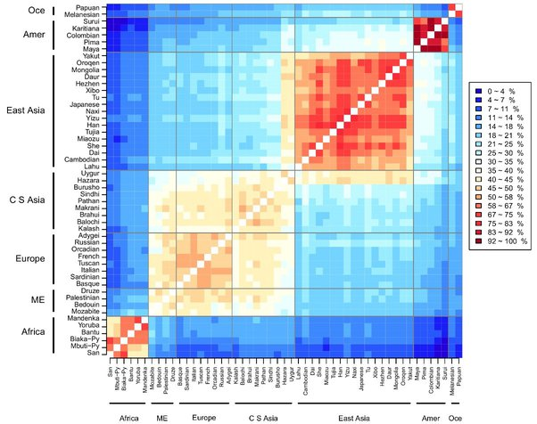

*Réponse publiée [sur Quora](https://fr.quora.com/Pourquoi-la-race-humaine-est-elle-différente-dun-continent-à-lautre/answer/Dr-Goulu)*

Ah j'ai retrouvé ce que je cherchais :

[Human genetic variation - Wikipedia](w:en:Human_genetic_variation)

Vous voyez que statistiquement en France la distance maximale est effectivement maximale avec les San, mais approximativement égale d'avec les Bantous et les Mélanésiens.

Mais curieusement les Toscans sont à équidistance des Surui du Brésil et des San …
