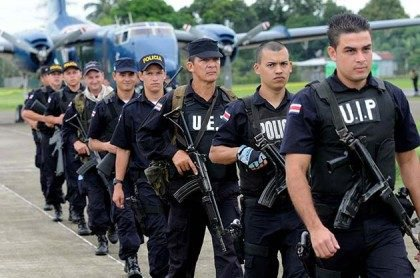

*Réponse publiée [sur Quora](https://fr.quora.com/Porteriez-vous-une-arme-à-feu-tous-les-jours-si-vous-aviez-le-droit-de-le-faire/answer/Michel-Verheughe)*

Bon, disons que j'ai visité le Costa Rica et que les troupes de police sont loin d'être désarmées… En fait si c'était pas écrit "police" sur leur casquette, on pourrait confondre.

Selon [Public Force of Costa Rica - Wikipedia](w:en:Public_Force_of_Costa_Rica) ils ont même des mitrailleuses et des lance-grenades. Et les mêmes pistolets et fusils d'assaut que l'armée suisse…

Les Etats-Unis fournissent une "aide" au Costa-Rica pour protéger ses frontières et combattre le trafic de drogue

[U.S. Relations With Costa Rica - United States Department of State](https://www.state.gov/u-s-relations-with-costa-rica/)

Bref, le Costa Rica c'est très chouette, mais il ne fait pas trop idéaliser leur pacifisme…
