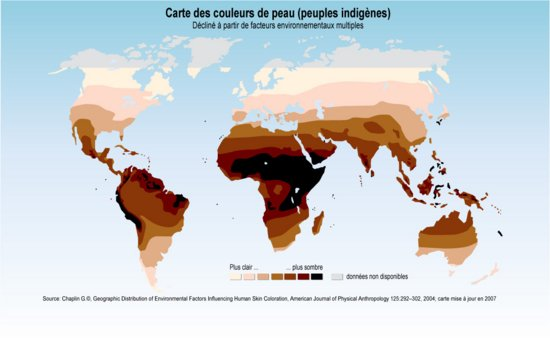

*Réponse publiée [sur Quora](https://fr.quora.com/Dans-quel-pays-dAfrique-on-retrouve-des-noirs-clairs-de-peau-et-qui-ne-sont-pas-métis-ou-ayant-une-origine-caucasienne-ou-autre/answer/Emmanuel-Kani)*

Mefiez vous des évidences. La mélanine est une protection solaire naturelle, son taux baisse aussi vers le sud.

Exemple au hasard :

