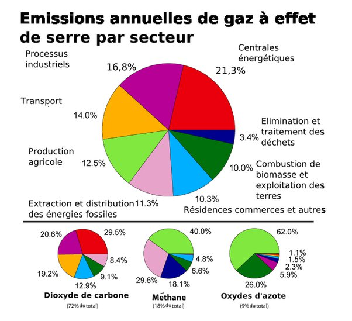

*Réponse publiée [sur Quora](https://fr.quora.com/Dans-les-mesures-durgence-pour-lutter-contre-les-changements-climatiques-et-leurs-r%C3%A9percussions-faudrait-il-arr%C3%AAter-la-p%C3%AAche-intensive-et-l%C3%A9levage-intensif-de-par-le-monde/answer/Dr-Goulu)*

Voici les sources anthropiques des gaz à effet de serre :

Vous voyez le problème ? Le problème est qu'il n'y a pas un secteur particulièrement polluant mais 7 d'importances très proches (10 à 20% chacun) et un plus petit.

Donc le vegan dit "faut arrêter l'élevage et la pêche" L'agriculteur dit "faut arrêter l'industrie". L'industriel dit "faut faire du nucléaire, pas brûler du charbon". Le type dans son usine électrique dit "faut arrêter la déforestation". Le paysan brésilien ou indonésien : "yaka rouler au bioethanol". Et vous dans votre bagnole "déjà faudrait extraire le pétrole plus proprement".

Le pollueur, c'est toujours l'autre. C'est pour ça que les accords de Paris laissent chaque pays faire comme ils veut pour atteindre les objectifs de réduction des émissions. Mais en définitive ce sera le comportement des consommateurs qui sera décisif.

Si vous voulez vous abstenir de manger du poisson ou de la viande, c'est très bien. Mais n'oubliez pas que plus d'un milliard d'humains rêvent depuis un siècle de pouvoir en manger plus souvent.
