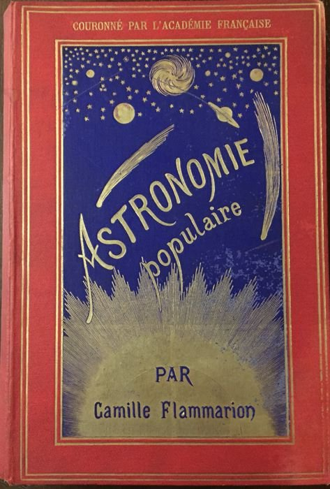

*Réponse publiée [sur Quora](https://fr.quora.com/Quel-livre-qui-est-sorti-il-y-a-plus-de-50-ans-poss%C3%A9dez-vous/answer/Dr-Goulu)*

[Astronomie populaire de Camille Flammarion, édition 1890](w:Astronomie_populaire_(Camille_Flammarion))

Un livre extraordinaire, d une précision incroyable et qui se termine par les 3 grandes interrogations de l'époque :

1. Quelle est la source d'énergie du Soleil ?
2. Pourquoi Mercure ne tourne pas rond ?
3. Que sont les nébuleuses ?

Les réponses ont été obtenues dans les quelques décennies suivantes, en révolutionnant totalement la physique et notre vision de l'univers.
