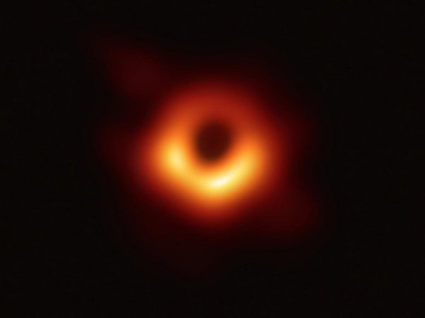

*Réponse publiée [sur Quora](https://fr.quora.com/Y-a-t-il-quelque-chose-de-plus-puissant-quun-trou-noir/answer/Dr-Goulu)*

On peut imaginer tout ce qu'on veut, mais la science ne fonctionne pas avec l'imagination.

On observer très bien les nombreux effets des trous noirs, on en a des modèles très précis et exacts : ils agissent sur les étoiles voisines comme prévu, leurs disques d'accrétion rayonnent comme prévu et ils tournent à la vitesse de censure cosmique comme prévu.

Et si, on a fait une observation directe de trou noir : M87*, en 2019.

