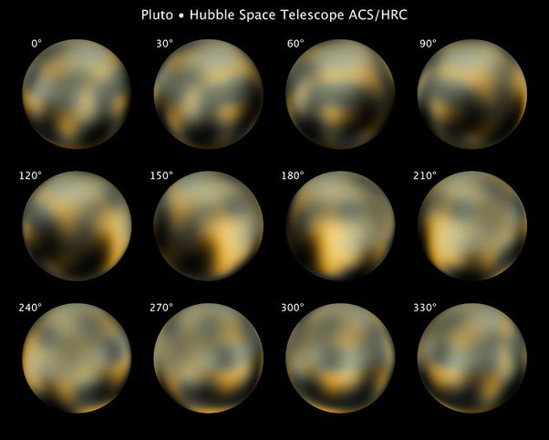

*Réponse publiée [sur Quora](https://fr.quora.com/Pourquoi-le-t%C3%A9lescope-Hubble-ne-peut-il-pas-prendre-une-image-claire-de-Pluton/answer/Dr-Goulu)*

Vous n'imaginez pas à quel point Pluton est loin et petit.

La [Taille apparente](w:)de Pluton depuis la Terre est au maximum de 0.11 secondes d'arc, soit environ 30 millionièmes de degré

La résolution angulaire de Hubble est de 0.04 secondes d'arc[[1]](#WuVrV). Sur les images brutes, Pluton apparaît comme ayant un diamètre de 3 pixels …

Donc ces images :

(source : [Hubble's full photomap of Pluto](https://esahubble.org/images/opo1006h/) )

ont été obtenues après des heures d'interpolation

Notes de bas de page

[[1]](#cite-WuVrV)[NASA - Hubble Space Telescope](https://www.nasa.gov/missions/highlights/webcasts/shuttle/sts109/hubble-qa.html)
