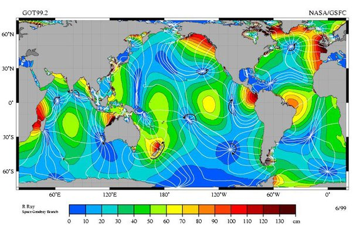

*Réponse publiée [sur Quora](https://fr.quora.com/Je-me-posais-la-question-ya-t-il-une-mer-non-influenc%C3%A9e-par-la-lune-Ou-une-%C3%A9tendue-deau-importante/answer/Dr-Goulu)*

La lune n'influence pas directement la mer. C'est une phénomène de résonance qui crée les marées, et un peu comme quand vous vous balancez dans votre baignoire, il y a des endroits même en plein océan où les marées sont très faibles.

Ce sont les régions en bleu sur cette carte, et aux points blancs la marée est carrément nulle :

plus de détails là :

[https://www.drgoulu.com/2017/08/...](https://www.drgoulu.com/2017/08/15/combien-de-maree/)
