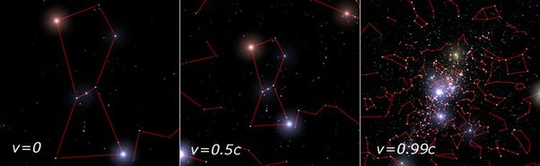

*Réponse publiée [sur Quora](https://fr.quora.com/Si-nous-pouvions-voyager-à-99-de-la-vitesse-de-la-lumière-comment-se-sentirait-l-équipage-au-jour-le-jour-à-l-intérieur-du-vaisseau-et-quelle-serait-la-vue-que-nous-aurions-à-travers/answer/François-Désarménien)*

jolies images de simulations ici : [What would a relativistic interstellar traveller see?](https://math.ucr.edu/home/baez/physics/Relativity/SR/Spaceship/spaceship.html)

