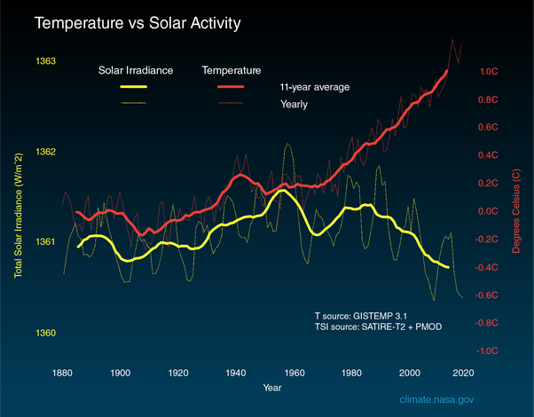

*Réponse publiée [sur Quora](https://fr.quora.com/Quel-est-le-niveau-dinfluence-du-cycle-solaire-sur-le-climat-terrestre/answer/Dr-Goulu)*

Le [Cycle solaire](w:)de 11 ans provoque une variation de l'irradiance solaire de 0.15% au maximum et selon ce passage de [FAQ: How Does the Solar Cycle Affect Earth's Climate?](https://www.nasa.gov/mission_pages/sunearth/solar-events-news/Does-the-Solar-Cycle-Affect-Earths-Climate.html) de la NASA :

> les scientifiques n'ont pas été en mesure de trouver des preuves convaincantes que le cycle de 11 ans se reflète dans les aspects du climat au-delà de la stratosphère tels que la température de surface, les précipitations ou les vents.

Pour les variations à plus long terme:

> Les modèles informatiques suggèrent que si l'irradiance solaire augmentait ou diminuait constamment pendant de nombreuses décennies, la température moyenne sur Terre changerait également. L'ampleur de ces changements serait probablement faible - environ**quelques dixièmes de degrés en moyenne mondiale** …

Or

> les observations spatiales des 35 dernières années n'ont pas enregistré de changements substantiels dans la production d'énergie du Soleil. Néanmoins, les scientifiques incluent toutes les influences possibles (y compris les changements solaires) lorsqu'ils étudient les changements climatiques. Ces estimations suggèrent qu'**une légère diminution de l'irradiation solaire au cours des 35 dernières années aurait provoqué un léger refroidissement du climat au cours de cette période**.

Sur [What Is the Sun's Role in Climate Change? – Climate Change: Vital Signs of the Planet](https://climate.nasa.gov/blog/2910/what-is-the-suns-role-in-climate-change/) de la NASA toujours on trouve ce graphique éloquent :

le rôle du Soleil est minime, le notre est déterminant.
