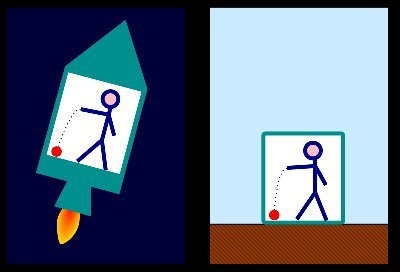

*Réponse publiée [sur Quora](https://fr.quora.com/Que-se-passerait-il-si-la-force-qu-exerce-la-terre-pour-nous-maintenir-au-sol-ne-d%C3%A9pendait-pas-de-la-masse-et-%C3%A9tait-la-m%C3%AAme-pour-tout-le-monde/answer/Dr-Goulu)*

Merci pour cette excellente question qui prouve que justement, la Terre ne nous maintient pas au sol avec une force qui dépend de la masse.

Parce que si c'était comme ça, la Terre devrait en quelque force "mesurer" notre masse pour savoir avec quelle force nous attirer. Ou nous devrions "dire" à la Terre quelle masse nous avons pour qu'elle puisse nous attirer. Bref il devrait y avoir un échange d' "information", ou de quelque chose véhiculant d'une certaine manière cette force de gravité.

Et on pensait très sérieusement que c'était comme ça, puisque c'est comme ça pour les 3 autres [interactions élémentaires](w:Interaction_élémentaire)qui ont chacune leur [Boson de jauge](w:). Pour la gravité, il devait y avoir le [Graviton](w:).

Sauf qu'on en voit désespérément pas la queue d'un, malgré toute l'énergie qu'on met dans les particules du LHC, qui se convertit en masse à vitesse relativiste, masse qui est re-convertie en énergie lors de collisions. Et cette brutale baisse de masse devrait produire des gravitons. Mais y'en a désespérément pas.

Et là Albert se marre, parce qu'il nous le répète depuis 1915 : y'a pas de graviton parce qu'il y a pas de force de gravitation ! il n'y a que des déformations de l'espace-temps qui ressemblent tellement à des accélérations que c'est la même chose !

la Terre ne nous attire pas vers le bas, c'est elle qui "accélère" vers le haut !

Oui je sais, ça choque. Je ne m'en suis toujours pas remis moi-même. Mais avant de hurler dans les commentaires lisez svp [Réponse de Dr. Goulu à Comment le fait que l'espace soit courbé fait-il que la gravité nous tire vers le bas ?](https://fr.quora.com/Comment-le-fait-que-lespace-soit-courb%C3%A9-fait-il-que-la-gravit%C3%A9-nous-tire-vers-le-bas/answer/Dr-Goulu) jusqu'à la fin, y compris la traduction du petit document du Perimeter Institute hébergé au CERN à la fin, comme ça j'ai pas besoin de tout répéter.

Ici je vais juste répondre à la question, enfin…

Donc la Terre accélère vers le haut à g=9.81m/s^2 et nous avec, ce qui nous donne notre poids p=g.m qui n'est du à rien d'autre que notre inertie.

Si la Terre devait attirer "tout le monde" avec la même force p=cste, elle serait vachement embêtée pour "savoir" qui fait partie de "tout le monde", qui est une fourmi, un éléphant, un proton ou une montagne. Là il faudrait absolument que des gravitons le lui disent pour que sa surface puisse accélérer vers le haut différemment en fonction de ce qu'il y a dessus…

Bref, ça serait vachement délire. Et Albert aurait eu tort, ce qui est totalement inacceptable. Tout comme la faute de grammaire de la question qui m'a fait mal aux yeux pendant les 15 minutes de rédaction de cette réponse. Je craque, je la corrige.
