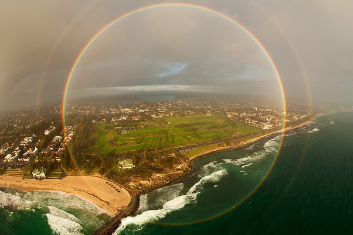

*Réponse publiée [sur Quora](https://fr.quora.com/Pourquoi-les-arcs-en-ciel-ont-ils-cette-forme/answer/Glaire)*

Si le sol ne les intercepte pas , ça fait des cercles entiers …

Source: oskarslidums sur [Reddit](http://www.reddit.com/r/woahdude/comments/2d7vyk/in_very_rare_circumstances_it_is_possible_to_see/)
