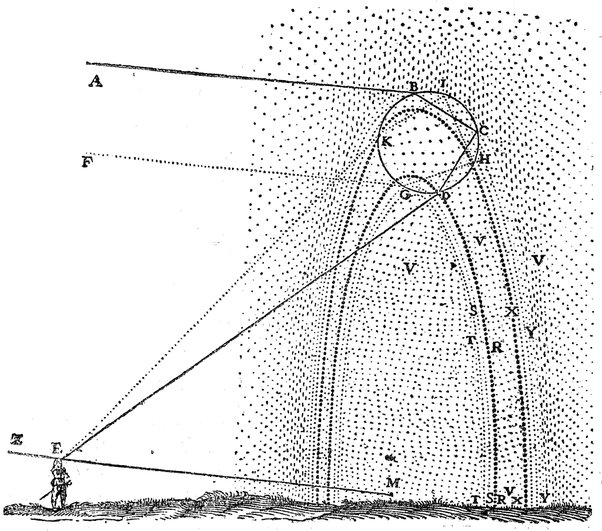
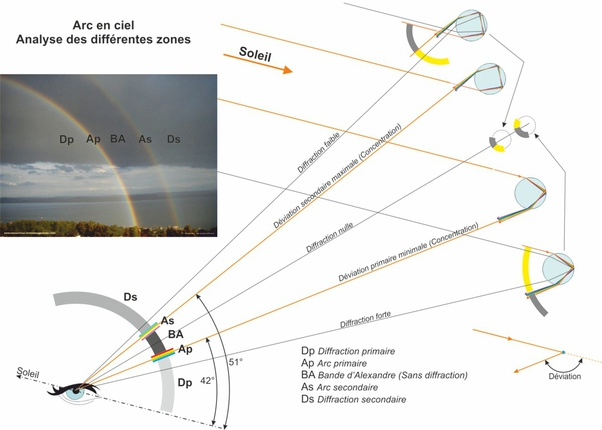

*Réponse publiée [sur Quora](https://fr.quora.com/Pourquoi-les-arcs-en-ciel-ont-ils-cette-forme/answer/Glaire)*

vraiment ? vous n'avez pas compris comment un arc-en-ciel se forme, alors … René Descartes a fait ce dessin en 1637 :

version moderne :

[Arc-en-ciel — Wikipédia](w:Arc-en-ciel)
