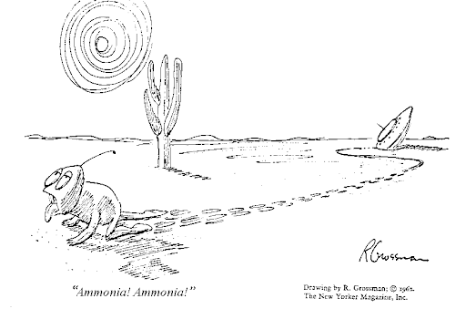

*Réponse publiée [sur Quora](https://fr.quora.com/La-vie-peut-elle-appara%C3%AEtre-dans-un-autre-solvant-que-l-eau-Pourquoi-seulement-l-oxyg%C3%A8ne-permet-il-d-alimenter-la-vie/answer/Dr-Goulu)*

séparez les questions svp.

pour la première, [Biochimies hypothétiques — Wikipédia](w:Biochimies_hypothétiques) liste les quelques alternatives potentielles à l'eau:

1. l'ammoniac, mais il est douteux qu'il existe des océans d'ammoniac pur ou "salé"
2. le fluorure d'hydrogène, mais il est encore plus douteux qu'il en existe en grande quantités sous forme liquide.

Dans les deux cas, les chimies possibles dans ces solvants, que ce soit avec du carbone, du silicium ou même de l'azote+phosphore ne permettent pas vraiment de faire des molécules aussi complexes et stables que la chimie organique dans l'eau, qui existe certainement partout en grande quantités.

Pour l'oxygène, vous vous trompez complètement. Les premières formes de vie terrestres étaient anaérobies : elles vivaient grâce au CO2 dissout dans l'eau et à la photosynthèse, et chiaient de l'oxygène toxique, ce qui a causé la [plus grave crise écologique de tous les temps](w:Grande_Oxydation) et failli exterminer la vie sur Terre .

La vie s'en est sortie d'extrême justesse grâce à des parasites dans notre genre, les animaux, qui récupèrent l'énergie des plantes en ré-oxydant leur matière et re-dégagent du bon CO2 à l'origine de la vie ;-)
