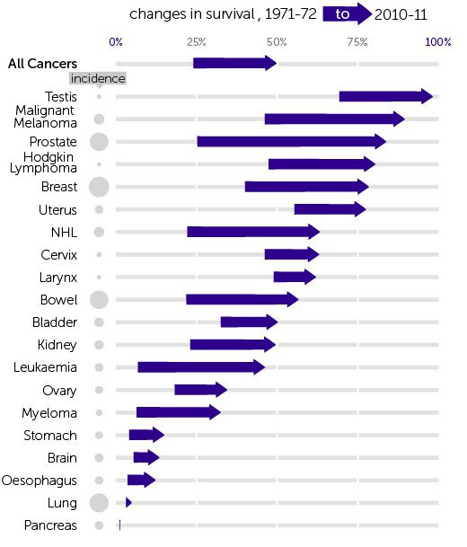
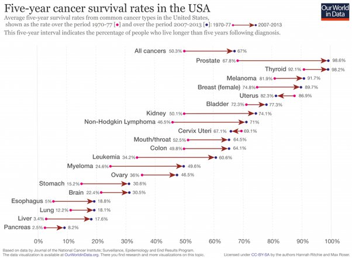

*Réponse publiée [sur Quora](https://fr.quora.com/Pourquoi-les-autorités-sanitaires-et-politiques-ne-manifestent-elles-pas-la-même-énergie-et-les-mêmes-moyens-à-prévenir-et-soigner-le-cancer-Alzheimer-ou-Parkinson-que-le-COVID-19/answer/Dr-Goulu)*

je suis persuadé qu'on A investi plus. Pour le Covid on a pratiquement rien investi du tout : des affiches, des masques et des vaccins qui ont été prêts en quelques mois.

Et en passant, les recherches sur les cancers ont diminué globalement leur mortalité de 25%

et ça ce sont les chiffres mondiaux, parce que dans un pays industrialisé comme les USA c'est encore mieux :

[Cancer death rates are falling; five-year survival rates are rising](https://ourworldindata.org/cancer-death-rates-are-falling-five-year-survival-rates-are-rising)
