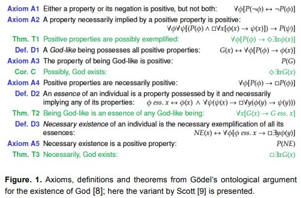

_Réponse publiée_ [_sur Quora_](https://fr.quora.com/L%C3%A9nonc%C3%A9-Dieu-existe-est-une-proposition-vraie-au-sens-logique-et-math%C3%A9matique-C-BENZM%C3%9CLLER-Quen-pensez-vous/answer/Dr-Goulu)

Les propositions vraies au sens logique et mathématique reposent sur un [Système axiomatique](w:).

Les articles de Benzmüller [1,2] concernent la preuve de l'existence de dieu proposée par Gödel, qui avait soigneusement choisi des "axiomes" permettant de démontrer son théorème, le petit malin :

Benzmüller a utilisé un logiciel de démonstration automatique de théorème et a découvert.. que Gödel s'est planté : L'[argument ontologique de Gödel](w:Preuve_ontologique_de_Gödel) est inconsistant avec ses axiomes [3] !

Je peux faire mieux :

Axiome 1 : le Monstre de Spaghetti Volant existe.

Théorème fondamental du [Pastafarisme](w:) : le Monstre de Spaghetti Volant existe.

Démonstration : vrai en vertu de l'axiome 1. CQFD et Ramen !

**Références :**

1. Benzmüller, C., & Woltzenlogel Paleo, B. (2014). [Automating Gödel's Ontological Proof of God's Existence with Higher-order Automated Theorem Provers](https://doi.org/10.3233/978-1-61499-419-0-93) . _Frontiers in Artificial Intelligence and Applications_, _263_. 
2. Benzmüller, C. (2017). [Experiments in Computational Metaphysics: Gödel's Proof of God's Existence](https://orbilu.uni.lu/handle/10993/33621) ( [pdf](https://core.ac.uk/download/pdf/141495131.pdf) )
3. Benzmüller, C. (2016). [The inconsistency in Gödel's ontological argument](https://dl.acm.org/doi/abs/10.5555/3060621.3060751) _Proceedings of the Twenty-Fifth International Joint Conference on Artificial Intelligence_, 936–942. 
