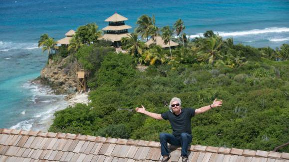

*Réponse publiée [sur Quora](https://fr.quora.com/Les-hommes-et-la-nature-peuvent-ils-vivre-en-harmonie/answer/Dr-Goulu)*

C'est quoi la nature ? La nature ne vit pas, ce sont des milliards d'individus de millions d'espèces qui vivent. Les rats, le blé, les bœufs et les palmiers à huile sont parmi les nombreuses espèces qui "vivent en harmonie" avec nous : elles ont des centaines de fois plus d'individus grâce à nous.

Ok, il y a aussi de très nombreuses espèces qui se réduisent voire disparaissent à cause de nous. Dommage. Mais dans ces espèces disparues, il y a par exemple le virus de la variole, ou celui de la polio qui est en train de disparaître. Qui va les regretter ? Pourquoi pleure-t'on sur le dodo et pas sur le virus de la variole ?

Le truc, c'est qu'il n'y a pas d'arbitre, ni d'indicateur de l' "harmonie" entre les espèces. C'est nous qui décidons ce qui est bien ou mal. Et jusqu'ici, on a décidé qu'avoir assez à manger pour nourrir nos enfants, éviter qu'ils se fassent bouffer par des prédateurs ou crèvent de maladies, c'était bien.

Maintenant que les européens ont déforesté tout leur continent et exterminé tous leurs prédateurs, on dit aux brésiliens "non mais gardez votre forêt amazonienne, la biodiversité c'est important…" et aux africains "gardez vos lions et vos crocos. ok ils bouffent un enfant de temps en temps, mais c'est trop cool de voir encore des animaux sauvages quand on vient en safari…"

En gros chacun de nous aimerait vivre en harmonie avec la nature, mais dans une villa de 300m2 avec climatisation, quelques hectares de culture bio autour et piste d'atterrissage pour le jet privé…

regardez comme il est en harmonie avec la nature : le toit est en bois !
