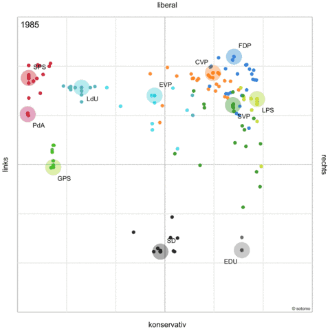

*Réponse publiée [sur Quora](https://www.quora.com/Which-country-is-generally-more-right-wing-both-culturally-and-economically-the-United-States-or-Switzerland/answer/Dr-Goulu)*

the question was about US and Switzerland only. The graph shows the position of the “Social Democratic Party” of Switzerland I’m talking about in the answer, that’s all.

In Switzerland we have a very reliable mathematically based way of measuring the left/right positioning of parties and politicians thanks to [smartvote.ch](https://smartvote.ch/). it produces maps like these that can even be “animated” to show the political changes across time

the methodology is described (in german only, sorry…) here : [https://sv19.cdn.prismic.io/sv19...](https://sv19.cdn.prismic.io/sv19/fcff287e-aa5e-4f5c-ae46-f3d53d6e0b30_methodology_smartmap_de.pdf)

I just noticed Australia has adopted this approach : [https://act.smartvote.org/en/abo...](https://act.smartvote.org/en/about-us)

(and I started to apply the method to France here : [GitHub - goulu/smartvoteFR](https://github.com/goulu/smartvoteFR) )

Use the same approach in the US and we will have an objective way to compare ;-)
