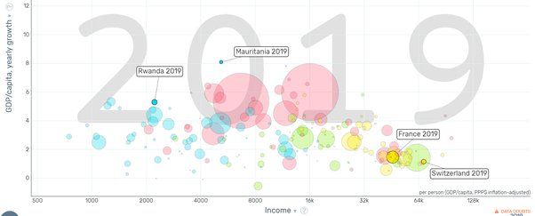

*Réponse publiée [sur Quora](https://fr.quora.com/A-quoi-ressembleront-les-pays-en-d%C3%A9veloppement-dans-les-10-prochaines-ann%C3%A9es/answer/Dr-Goulu)*

A des pays moins en développement.

La croissance par habitant dans la plupart des pays africains (en bleu) et asiatiques (en rouge) est nettement supérieure à celle de l'Europe (en jaune) et de l'Amérique du Nord (vert à droite)

(source : [Gapminder Tools](https://www.gapminder.org/tools/#$ui$chart$cursorMode=plus;;&model$markers$bubble$encoding$y$data$concept=gdp_per_capita_yearly_growth&space@=country&=time;;&scale$domain:null&zoomed@:0.85&:15.17;&type:null;;&x$scale$zoomed@:688.39&:180000;;;;;;;&chart-type=bubbles&url=v1) )
