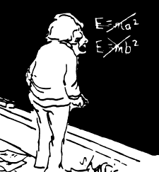

*Réponse publiée [sur Quora](https://fr.quora.com/Pourquoi-cette-%C3%A9nergie-Rayonnante-perdue-par-une-masse-est-en-rapport-avec-la-c%C3%A9l%C3%A9rit%C3%A9-de-la-lumi%C3%A8re/answer/Dr-Goulu)*

Parce que c'est comme ça.

Ce n'est pas une boutade : c'est vraiment très étonnant, surprenant, contre-intuitif et tout ce que vous voudrez comme qualificatif, mais c'est comme ça.

L'article d'Einstein (1905). [Ist die Trägheit eines Körpers von seinem Energieinhalt abhängig?](https://doi.org/10.1002/ANDP.19053231314) *Annalen Der Physik*, *323*(13), 639–641.

qui établit e=m.c^2 (en réalité il fait l'inverse : m=e/c^2 …) est génial de simplicité. 2 pages seulement ! la traduction en anglais, peut-être plus lisible, est [ici](https://www.fourmilab.ch/etexts/einstein/E_mc2/e_mc2.pdf) .

Bon, si vous voulez vraiment un "pourquoi", ben faut comprendre l'article : c'est une conséquence logique et immédiate des [Transformations de Lorentz](w:). Einstein a "simplement" écrit que l'énergie totale devait être la même qu'on se place dans le référentiel de la masse qui diminue ou dans celui d'une particule du rayonnement émis.

Non, il n'a pas fait comme ça :

