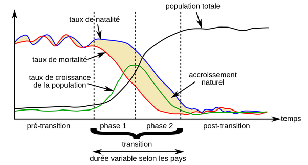

*Réponse publiée [sur Quora](https://fr.quora.com/Pourquoi-les-taux-de-natalit%C3%A9-sont-ils-plus-%C3%A9lev%C3%A9s-dans-les-pays-en-d%C3%A9veloppement-que-dans-les-pays-d%C3%A9velopp%C3%A9s/answer/Dr-Goulu)*

parce qu'avec un bon niveau de soins médicaux, les enfants survivent. Il n'en meurt plus les 2/3 comme il y a un siècle ou deux. Le temps que les femmes comprennent cela grâce à une meilleure éducation aussi, il se produit une [Transition démographique](w:) pendant laquelle la population augmente fortement.

Les pays développés ont traversé cette phase au début du 20ème siècle, et puis les pays asiatiques vers la fin du 20ème siècle, et maintenant de plus en plus de pays "en développement", ce qui fait qu'ils vont inévitablement devenir "développés" parce qu'ils ne perdront plus toute leur croissance économique dans l'augmentation de leur population.

Regardez les géniales présentations de Hans Rosling à ce sujet, par exemple

[https://www.ted.com/talks/hans_r...](https://www.ted.com/talks/hans_rosling_religions_and_babies?language=fr-CA)
