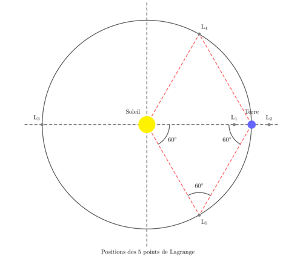

*Réponse publiée [sur Quora](https://fr.quora.com/Si-une-planète-en-tout-point-identique-à-la-terre-se-trouvait-à-lopposé-de-la-notre-par-rapport-au-soleil-sur-la-même-trajectoire-quand-sen-serait-on-rendu-compte/answer/Yacine-CHELBABI-1)*

Alors je fais un dessin :

La question demande s' [il n'y a pas une planète en orbite autour du Soleil à la même vitesse que la Terre sur le côté opposé du Soleil](https://fr.quora.com/Comment-savons-nous-quil-ny-a-pas-une-plan%C3%A8te-en-orbite-autour-du-Soleil-%C3%A0-la-m%C3%AAme-vitesse-que-la-Terre-sur-le-c%C3%B4t%C3%A9-oppos%C3%A9-du-Soleil). Ca correspond au point L3, tout à gauche sur le dessin, la Terre étant le point bleu à droite, et le soleil le truc jaune au milieu.

Je dis qu'avec les satellites [STEREO](w:)qui sont aux points L4 et L5 (en haut et en bas des triangles rouges) on peut très bien observer ce point, et voir qu'il n'y a pas de planète.

Voilà comment on peut (parfois) savoir que quelque chose n'existe pas, cher Yacine.

C'est plus clair ?
