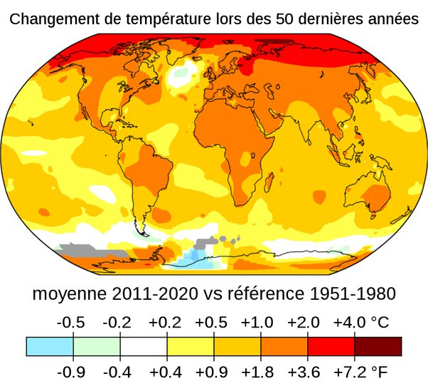

*Réponse publiée [sur Quora](https://fr.quora.com/La-temp%C3%A9rature-moyenne-terrestre-signifie-t-elle-une-augmentation-de-la-temp%C3%A9rature-%C3%A0-nimporte-quel-endroit-de-la-plan%C3%A8te/answer/Dr-Goulu)*

Non, mais il faut bien chercher …

sur cette image, vous voyez que les températures moyennes sur les 10 dernières années sont plus élevées que les moyennes pendant les 30 années de 1950 à 1980 partout sauf en Antarctique au contact avec l'Atlantique Sud, une petite zone dans l'Atlantique nord une tout petite zone de l'Antarctique au sud de l'Australie que j'ai failli ne pas voir.

Source : [https://data.giss.nasa.gov/giste...](https://data.giss.nasa.gov/gistemp/maps/index_v4.html)

Si vous la visitez, vous pouvez voir les écarts enregistrés le mois passé par rapport à la moyenne de 1951–1980 , et vous pouvez réaliser vos propres comparaisons.
