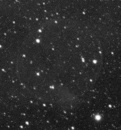
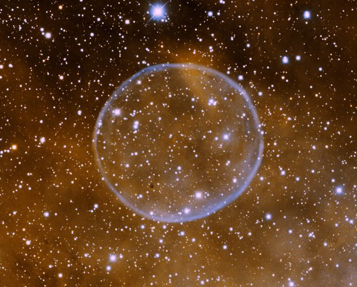

*Réponse publiée [sur Quora](https://fr.quora.com/Pourquoi-la-plupart-des-images-spatiales-sont-elles-coloris%C3%A9es/answer/Dr-Goulu)*

Vous voyez quelque chose ? Regardez bien … C'est ce que vous obtenez avec un appareil de photo "normal" et une pose de 30 minutes

.

.

.

.

.

.

Et maintenant regardez la même chose avec un capteur sensible à la raie [H-α](http://www.wikipedia.org/search-redirect.php?language=fr&go=Go&search=H-α) rendu en orange et la raie de l'[Oxygène III](http://www.wikipedia.org/search-redirect.php?language=fr&go=Go&search=O+III) en bleu :

non seulement c'est plus joli, mais surtout vous obtenez des informations de beaucoup plus grande valeur d'un point de vue astrophysique, en l'occurrence sur la composition chimique de la [Nébuleuse de la Bulle de savon](w:)

[https://www.drgoulu.com/2009/07/...](/2009/07/28/bulles-et-couleurs-dans-lespace/)
