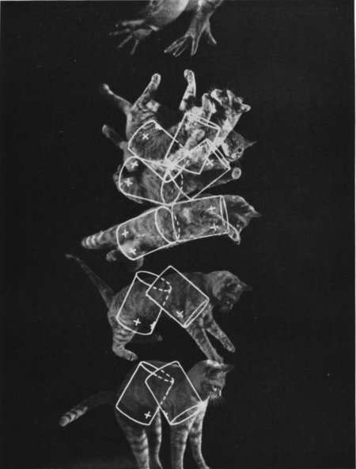
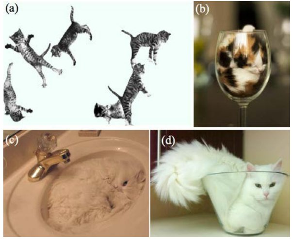

*Réponse publiée [sur Quora](https://fr.quora.com/Existe-t-il-une-th%C3%A9orie-math%C3%A9matique-d%C3%A9crivant-le-comportement-d-un-chat-ou-de-tout-autre-%C3%AAtre-vivant/answer/Dr-Goulu)*

Sur les chats il y a au moins deux articles d'une importance capitale :

- Kane, T. R., & Scher, M. P. (1969). [A dynamical explanation of the falling cat phenomenon](https://pentagono.uniandes.edu.co/~jarteaga/geosem/taller7/minicursoJK-Uniandes/robotic examples/kane.pdf) . *International Journal of Solids and Structures*, *5*, 663–670.

qui modélise un chat comme étant constitué de deux cylindres articulés et établit les équations du mouvement d'un chat se retournant lors de sa chute, avec cette splendide illustration d'époque, générée par ordinateur s'il vous plaît :

- Marc-Antoine Fardin “[On the rheology of cats](https://www.drgoulu.com/wp-content/uploads/2017/09/Rheology-of-cats.pdf)” *Rheology Bulletin*, vol. 83, 2, July 2014, pp. 16-17 and 30.

Lauréat du prix igNobel de physique 2017[[1]](#SQqtM) , cet article utilise la mécanique des fluides pour répondre à la question “Un chat peut-il être simultanément solide et liquide” en établissant notamment le [Nombre de Deborah](w:)du chat et en fournissant de nombreuses preuves expérimentales :

Notes de bas de page

[[1]](#cite-SQqtM)[Comment proposer un Ig Nobel - Pourquoi Comment Combien](https://www.drgoulu.com/2017/09/20/proposer-ig-nobel/)
