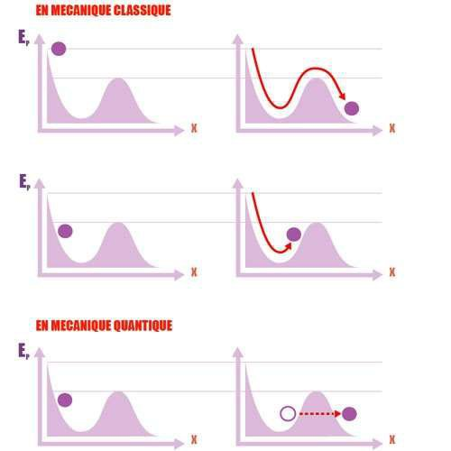

*Réponse publiée [sur Quora](https://fr.quora.com/Pourquoi-cet-effet-que-lon-appelle-tunnel-dans-lacc%C3%A9l%C3%A9ration-fortuite-des-particules-qui-rentrent-en-collision-dans-le-soleil/answer/Dr-Goulu)*

L'[Effet tunnel](w:)

> désigne la propriété que possède un objet [quantique](w:Mécanique_quantique) de franchir une [barrière de potentiel](w:) même si son énergie est inférieure à l'énergie minimale requise pour franchir cette barrière.

Ce n'est pas une "accélération fortuite" c est vraiment un passage par un "tunnel quantique" dans une barrière de potentiel :

Cet effet permet en effet la fusion de deux protons dans des étoiles comme le Soleil, où la température (=énergie cinetique des protons) n'est pas suffisante pour contrecarrer leur répulsion électrostatique à très faible distance. L'effet tunnel permet cependant la fusion dans 1 cas sur 10^28 collisions, ce qui suffit à faire briller notre étoile.
