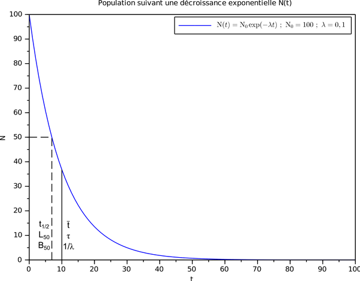
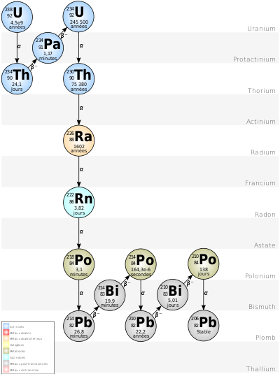

*Réponse publiée [sur Quora](https://fr.quora.com/Quest-ce-qui-fait-que-les-atomes-radioactifs-vieillissent-si-rapidement-et-se-d%C3%A9sint%C3%A8grent/answer/Dr-Goulu)*

Ils ne vieillissent pas, sinon ils se désintégreraient au bout d'un temps approximativement égal et suivraient une loi statistique plus ou moins "[normale](w:Loi_normale)".

Or ce n'est pas le cas, ils ont une durée de vie totalement imprévisible mais qui suit une loi exponentielle décroissante caractérisée par la [Période radioactive](w:) ou "demi-vie"

On peut visualiser ce qui se passe en se disant que dans un noyau, les protons et neutrons s'agitent dans tous les sens et qu'ils peuvent se retrouver dans une situation où un neutron, un proton ou une particule [alpha (un noyau d'helium)](w:Radioactivité_α) est éjecté, le noyau devenant plus stable après.

C'est plus difficile de se représenter ainsi la [Radioactivité β](w:)dans laquelle un proton se transforme en neutron ou vice-versa, mais l'idée est que le noyau devient plus stable après.

Sauf que ce n'est pas toujours le cas, il peut y avoir des étapes intermédiaires où il est moins stable. Par exemple dans la [Chaîne de désintégration](w:)de l'uranium 238 qui a une demi-vie de 4.5 milliards d'années, on passe successivement par des isotopes qui on 24.1 jours, 1.17 minutes, puis 245500 ans, puis (je saute quelques étapes jusqu'au Bismuth 234) 19.9 minutes, puis 164 millionièmes de seconde, 22.2 ans, 5.01 jours, 138 jours avant de devenir du plomb stable :

