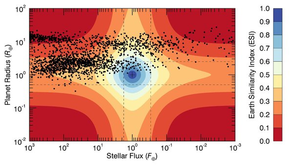

*Réponse publiée [sur Quora](https://fr.quora.com/Quelle-est-la-probabilit%C3%A9-quune-plan%C3%A8te-devienne-similaire-%C3%A0-la-Terre-lors-de-sa-formation/answer/Dr-Goulu)*

Similaire comment ?

L'[Indice de similarité avec la Terre](w:) (ESI) calculé pour les quelque 4700 exoplanètes détectées montre qu'une petite vingtaine est plus similaire à la Terre que Mars, qui a un ESI de 0.73. Si elle existe (ce n'est pas encore confirmé par d'autres instruments) [KOI-4878.01](w:en:KOI-4878.01)a un indice de 0.98. Et [TRAPPIST-1 d](w:)et [Teegarden b](w:en:Teegarden's_Star_b) sont à 0.95.

Donc on connait aujourd'hui grosso-modo une planète sur 1000 qui ressemble beaucoup à la Terre.

Mais si on regarde la carte sur le site[Earth Similarity Index (ESI)](https://phl.upr.edu/projects/earth-similarity-index-esi) , on voit un autre aspect important :

Pour l'instant, on est surtout capables de détecter des planètes différentes de la Terre, celles qui sont plus grosses (bande de points en haut) et celles qui sont plus près de leur étoile (nuage de points à gauche), parce qu'elles tournent plus vite autour et font plus souvent des [Transits](w:Transit_(astronomie)).

Parce qu'il faut le rappeler : même si nous étions tout près, disons sur [Proxima Centauri b](w:) (ESI = 0.87…) nous ne pourrions pas détecter la Terre avec nos instruments actuels

La prochaine génération d'instruments combinée à des périodes d'observation plus longues font qu'on va sans aucun doute bientôt pouvoir détecter des planètes de la taille de la Terre tournant autour d'étoiles comme le Soleil.

Et là le nuage de gauche va s'étaler vers la droite.

Et là on aura sans doute des centaines de planètes avec des ESI de 0.99 ou plus

Et ces instruments pourront aussi détecter des océans, des continents, des calottes polaires, des nuages, et surtout analyser l'atmosphère pour voir si elle contient de l'oxygène, quasi-preuve d'existence de la vie.

Ca va être cool. Je pense qu'après les alunissages, j'ai des chances raisonnables de vivre la détection de la vie sur une autre planète.
