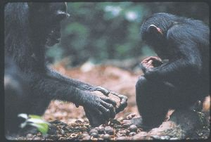

*Réponse publiée [sur Quora](https://fr.quora.com/La-connaissance-est-elle-quelque-chose-qui-distingue-lesp%C3%A8ce-humaine-sur-Terre/answer/Dr-Goulu)*

les chimpanzés ont des connaissances "culturelles", limitées à leur groupe, qu'ils se transmettent entre eux. Dans l'article [[1]](#ybeLI) on mentionne par exemple

> 
>
>
>
> Une mère chimpanzé de Taï, en Côte-d’Ivoire, montre à son petit comment ouvrir une noix de coula avec un marteau de pierre. Ce comportement n’existe pas chez les autres chimpanzés de la région qui vivent à quelques kilomètres, de l’autre côté de la rivière Saassandra-N’Zo, bien qu’ils aient aussi des noix et des pierres à leur disposition. La rivière est une « barrière culturelle ».
>
>
>
> © Michael Nichol/National Geographic Image Collection

J'ai aussi vu quelque part l'exemple d'un chimpanzé en zoo qui avait découvert qu'en jetant des graines dans l'eau, il pouvait les séparer du sable et de petites pierres. Toute sa tribu avait appris le truc, et quand on transféra un singe dans un autre zoo, il enseigna l'astuce à ses nouveaux congénères.

Donc non, ça ne nous distingue pas.

Notes de bas de page

[[1]](#cite-ybeLI)[La culture des chimpanzés](https://www.pourlascience.fr/sd/paleontologie/la-culture-des-chimpanzes-972.php)
