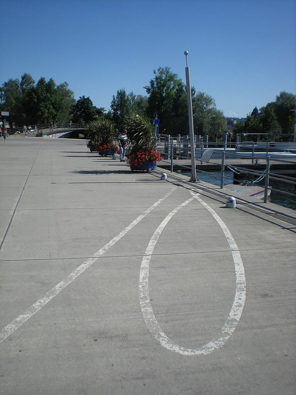
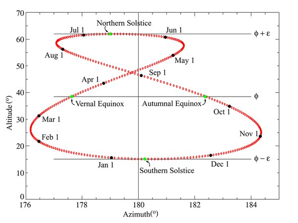

*Réponse publiée [sur Quora](https://fr.quora.com/Comment-a-%C3%A9t%C3%A9-d%C3%A9termin%C3%A9-l-angle-de-l-axe-terrestre-par-rapport-au-plan-de-l-%C3%A9cliptique/answer/Dr-Goulu)*

Devant la caverne de mon ancêtre Urgh, il y avait une grande pierre effilée dressée vers le ciel. Urgh avait déjà remarqué que l'ombre de la pierre bougeait, et pendant une journée de repos, il avait déjà posé une petite pierre au bout de l'ombre à chaque fois qu'il terminait de fumer une pipe.

A la fin de la journée, il avait regardé les 12 cailloux régulièrement espacés sur une longue courbe, et il avait dit "heur ?" tellement il était étonné.

Mais peu à peu, l'ombre de la grande pierre se décalait. Quand il faisait très chaud, l'ombre était plus courte, et 6 lunes plus tard, elle était beaucoup plus longue.

Ca a donné à Urgh une idée de travail pour sa fille Ana, qui était si paresseuse, qu'on l'appelait "Ana-flemme". Il lui dit : "si Ana veut steak de mammouth, Ana poser petit caillou chaque jour au bout de ombre quand ombre être la plus courte."

Petit à petit, les petits cailloux posés par Ana-flemme dessinèrent une forme si étrange qu'Urgh se dit qu'Ana faisait n'importe quoi, mais les jours où il a vérifié le travail de sa fille, il a vu qu'elle remplissait sa tâche avec précision, et pour que la postérité se souvienne d'elle, il donna son nom à la mystérieuse forme en huit que dessinaient les petits cailloux.

Puis, pendant quelques millénaires, des descendants d'Urgh et d'Ana-flemme continuèrent à dessiner des [Analemmes](w:Analemme), comme on les appelle aujourd'hui, en se demandant pourquoi le Soleil faisait ce drôle de 8 en nous tournant autour.

En voici un tracé à Bienne, Suisse :

Pendant des millénaires aussi, les astronomes ont tracé des analemmes jusqu'à ce qu'un illustré inconnu (par moi) fasse un petit dessin et se dise "mais c'est bien sur ! Comme l'axe de la Terre est incliné, l'angle est la moitié de la hauteur de l'analemme, epsilon sur le dessin !"

