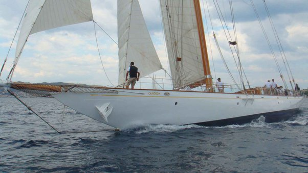
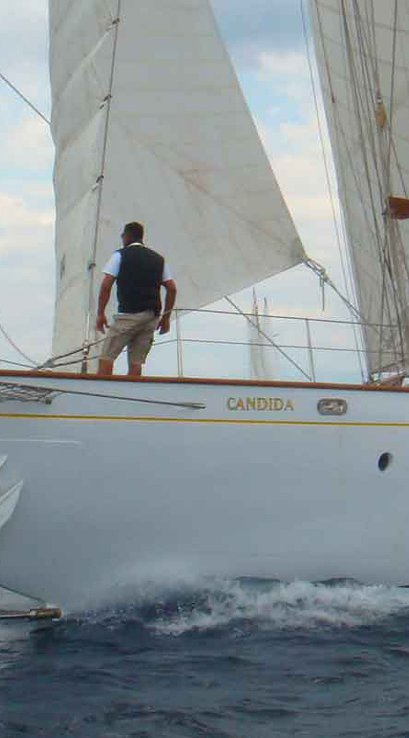

*Réponse publiée [sur Quora](https://fr.quora.com/Comment-appelleriez-vous-votre-yacht-si-vous-en-aviez-un/answer/Dr-Goulu)*

Avec un copain voileux, on s'était retrouvé à Antibes à côté de "[Candida](https://classicyachtinfo.com/yachts/candida/)", un magnifique [Classe J](w:Classe_J_(yacht)) construit en 1929,

Un membre de l'équipage était sur une chaise de calfat pendue au bastingage et repeignait le nom du bateau en lettres d'or que vous pouvez distinguer sur cette photo :

mieux là :

On a été faire un tour une heure, et quand on est revenus il était à la lettre suivante : 1 heure par lettre, un jour de boulot …

Alors avec le copain on s'est dits que si un jour on avait un super yacht, on le baptiserait

au spray rouge, et on irait l'amarrer à Antibes ;-)
